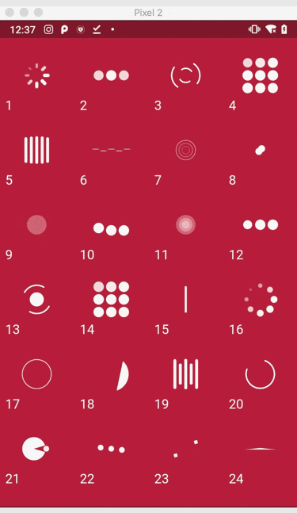

# loading_indicator_view

Flutter 版本的 loading indicator view

## Demo

## Animation types

| :--: | :--: | :--: | :--: |
|1. LineSpinFadeLoaderIndicator | 2. BallBeatIndicator | 3. BallClipRotateMultipleIndicator | 4. BallGridPulseIndicator|
|5. LineScaleIndicator | 6. BallPulseRiseIndicator | 7. BallScaleRippleMultipleIndicator | 8. BallZigZagIndicator|
|9. BallScaleIndicator | 10. BallPulseSyncIndicator | 11. BallScaleMultipleIndicator | 12. BallPulseIndicator|
|13. BallClipRotatePulseIndicator | 14. BallGridBeatIndicator | 15. SquareSpinIndicator | 16. BallSpinFadeLoaderIndicator|
|17. BallScaleRippleIndicator | 18. SemiCircleSpinIndicator | 19. LineScalePulseOutIndicator | 20. BallClipRotateIndicator|
|21. PacmanIndicator | 22. BallRotateIndicator | 23. CubeTransitionIndicator | 24. TriangleSkewSpinIndicator|

# Licence
    Copyright 2017 Hitomis, Inc.

    Licensed under the Apache License, Version 2.0 (the "License");
    you may not use this file except in compliance with the License.
    You may obtain a copy of the License at

        http://www.apache.org/licenses/LICENSE-2.0

    Unless required by applicable law or agreed to in writing, software
    distributed under the License is distributed on an "AS IS" BASIS,
    WITHOUT WARRANTIES OR CONDITIONS OF ANY KIND, either express or implied.
    See the License for the specific language governing permissions and
    limitations under the License.